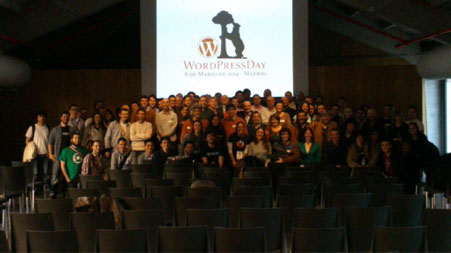

# WordPress Bilbao - Case Study

# Chapter 1 - Introduction

## The Intention of this Case Study

My intention is to provide my/our experience in organizing a local WordPress meetup. I hope that this information helps you to take ideas for your local meetup and make it work.

## My situation with WordPress

I started to use WordPress in mid 2013, a friends cousin wanted a new website and had to learn about it… and there it was our loved WordPress!

I found a Meetup in Madrid, was a WordPress Day, I thought it was a great opportunity to go there and learn about WordPress. It was incredible how people help each other and how much you can learn there and not just online.

## The WordPress Situation in Bilbao

I came back from Madrid and start participating in the spanish community via Slack. My best opportunity was to participate as a Polyglot, there was no need to know about code and I could help.

I entered the WordPress Spain Slack to meet more people of the community. I went to some other WordPress Day near home and was perfect way to learn more about WordPress.

But there wasn’t any WordPress community in Bilbao and in Slack other members encourage me to organize it, so… in January of 2015 I started with this incredible travel.