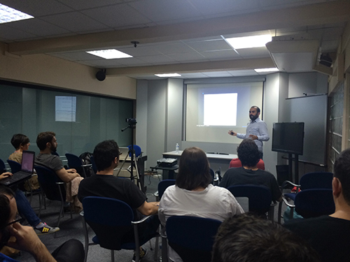
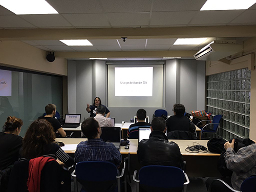
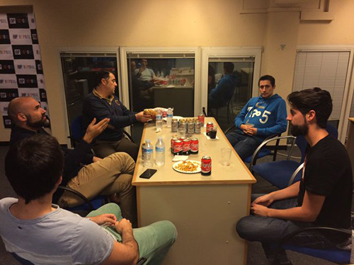

# WordPress Bilbao - Case Study

# Chapter 3 - Meetups Organization

We started organizing one meetup per month, but in the third month we saw that something was going wrong... People that was coming to meetups was different in each meetup. Why?

## Each person is different

The WordPress community members have different profiles, internest and/or abilities.

**If meetups subjects where different, then, people was different.**

We have to know what people it's interested in and organize meetups for them. For this, we have to categorize the different profiles and organize meetups for each of those profiles.

# 3 Categories

With this in mind, we created 3 different meetups each month. Thanks to this, the attendees to the meetups have nearly the same profiles, skills and interests.

In each category we try to combine direct WordPress stuff with other very useful things for everybody in the field, even if they don't use WordPress. Because this, we usually have attendees of other communities that come to learn and share knowledge.

## Category 1 - General

**Format:** Presentation ( 1h 30' ) + Q&A + Networking
**Attendees:** New WordPress users, bloggers, companies website responsable, journalists, etc.

### Section 1

How to install/configure/use WordPress, install/configure Plugins (such as Woocommerce or Yoast).

### Section 2

SEO, Digital Marketing, Podcast, etc.

**Example:** First meetup about SEO on-page and off-page (for everyone with a website, not just WordPress) + Second meetup about how to install and configure Yoast plugin.

## Category 2 - Developers

**Format:** Presentation/Workshop ( 1h 30' ) + Q&A + Networking
**Attendees:** New developers, WordPress developers, other programming language users, other CMS developers, etc.

### Section 1

Setting up development environment, WordPress Codex, Hooks and Filters, how to develop Plugins and Themes, etc.

### Section 2

Learn Git, VVV, Docker, PHP Frameworks, Javascript, etc.

**Example:** We can learn about how to start programming (useful for anyone) and combine it with WordPress development guides and projects.

With this, we can meet a lot of people, other developers and professionals, and not just WordPress professionals.

## Category 3 - Professional

**Format:** Open Discussion / Q&A + Networking
**Attendees:** freelance, startups, companies, people that wants to be freelance, etc.

### Section 1

We organize people in tables, max 8 member per table, and they are mixed by their profile. We have some topics prepared in advance, but normally each table speaks and discuss topics and help each other.

### Section 2

We organize some meetups that are centered in professional learning. For example, we bring legal advisors that help people to understand all the legal stuff for freelancing or starting a startup.

**Example:** some of the topics can be:

* What process do you use for the first time contact with a customer?
* How to get paid
* Charge by hour or by project?
