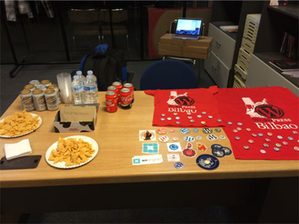

# WordPress Bilbao - Case Study

# Chapter 4 - Networking



If you just go to a meetup, sit on a chair, listen and go back home... you can just watch the meetup video in Youtube.

It's very important to offer a networking time and space when you organice a Meetup. The great thing of a meetup is to speak with people and make new relations and friends.

That's why we always have something to eat and drink. We encourage people to present themeself so everyone knows each other.

When the speaker finishes, we make people stay with us for some drinks and let networking work.

As we organize the meetups in Friday afternoon, people stays for long time after the meetups... some meetups went to 4 hours long!

```
For the next meetup, buy some drinks and let people do networking
```
