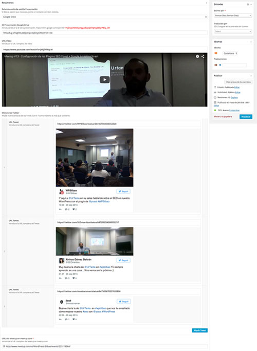
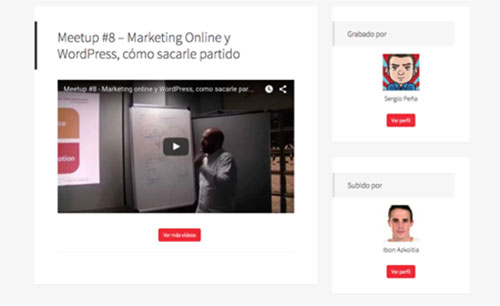

# WordPress Bilbao - Case Study

# Chapter 5 - Volunteer Roles

It's very important to let people participate in the community, and no just one guy organizing the Meetups.

That's why, thanks to Slack, we manage the community workflow.

## Role Examples

* **Bloggers:** some of the community members write about news or meetups reviews.
* **Videos:** other members recrod the meetups and upload them to Youtube.
* **Translators:** as we have two languages here, Basque and Spanish, some of the members translate the articles.

## Trello

We use a simple Trello dashboard to manage the task workflow, column examples:

* **Pending:** we have task templates to just duplicate and use
* **Doing:** the member takes a task and starts doing it
* **Translate Pending:** in case of needed, the blogger assigns the task to the translators. One of the translators takes the task and moves to te next column.
* **Translating:** same as doing but for translators
* **Pending to Post:** the translator assigns the task to an Editor and after review it, the article it's publish.

## Website

Thanks to Custom Post Types and Custom Fields, we can make easier to add new meetups reviews so anyone can participate and contribute.

In a meetup review there is always nearly the same information:

* Review
* Slides URL
* Youtube Video URL
* Twitter tweets URL
* Meetup.com Event URL
* Writer
* Translator

## Gamification

It's important that contributors can feel that are part of the community so the get more involved. That's why when someone writes or translates an article, or records/uploads a video, their image appears.

Their profile image and a link to their profile appears in the sidebar of the article or the video.
