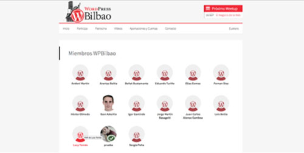
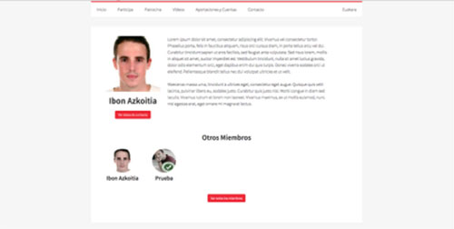
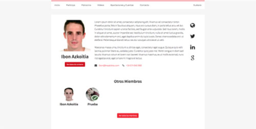

# WordPress Bilbao - Case Study

# Chapter 6 - Members Profile

In the community website we have a Members Section and Profile. People can register and create their own profile.

The idea is to create a members repository and help to finde other members by name, profile, etc. It's still in development, but it will be a great section.

All members can contribute via Github to the website development.